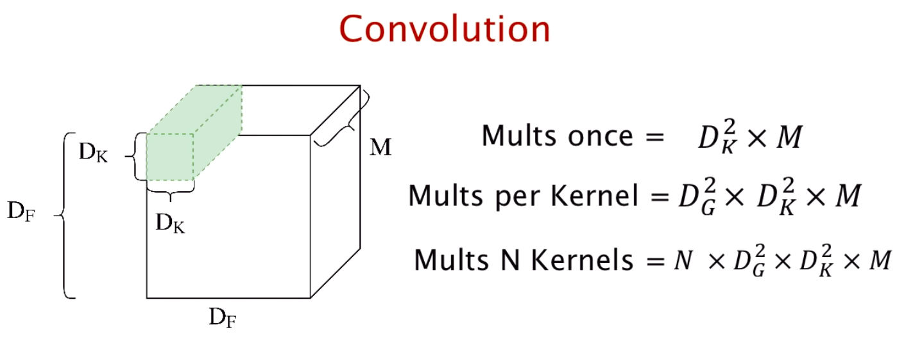
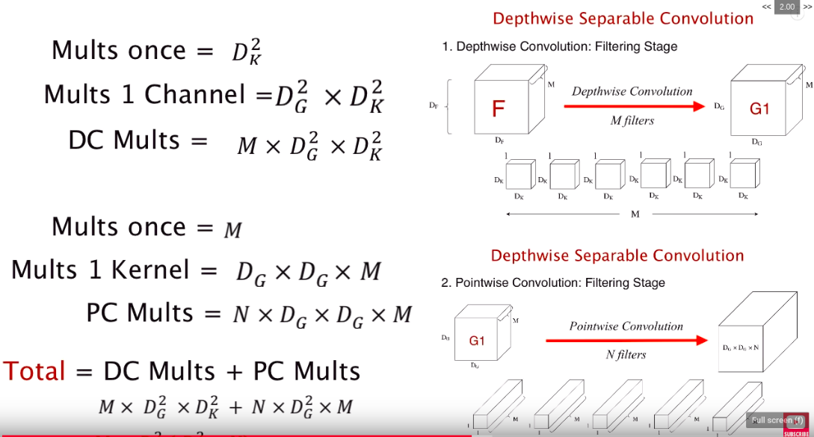
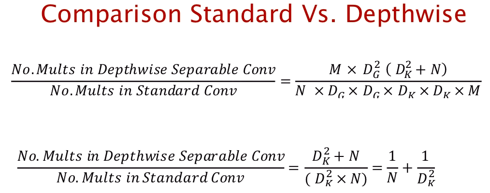
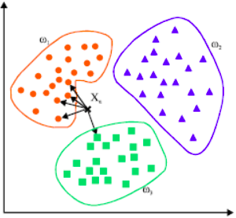

# Classify Anything!

A train-on-the-fly real-time webcam classifier in web browser I made after learning [**TensorFlow.js**](https://www.tensorflow.org/js) for model deployment. Built with TF.js, HTML, JS, and CSS. I used **Transfer Learning** with [**MobileNet**](https://arxiv.org/abs/1704.04861) as the base model and a **KNN Classifier** on top of the extracted features, the model inference makes accurate predictions with minimal training data given. 

Since the algorithm constantly predicts the live video stream and outputs its prediction above the buttons, MobileNet was chosen due to being light weight (**Depth Separable Convolution**). However, it does not have the best accuracy in object detection/classification. This issue is mitigated by limiting the scope of the problem to a few classes/types of images with the trainable KNN classifier. The math is explained in section Interesting Background. 

---

## Demo

  <a href="http://www.youtube.com/watch?v=Kz4FU2-iAhI"><b>Watch the 3am Video Demo</b></a>
   
  

In the video demo, 5 classes/types of images were included. I first clicked on the 5 classes buttons to capture classes of training images for the KNN classifer, then I evaluated the trained model by examining the predictions it makes as I switch between different classes. Focus on how the prediction the model makes changes based on the classes if detects. Note that the classes of images can be different poses, expressions, objects, environments, hand gestures, written letters... sky ain't the limit.

**CLASS 1**&emsp;My head\
**CLASS 2**&emsp;My head with blue ray glasses\
**CLASS 3**&emsp;My head with blue ray glasses and a hat\
**CLASS 4**&emsp;My head with blue ray glasses and a hat and a headphone\
**CLASS 5**&emsp;My head with blue ray glasses and a hat and a headphone and a big bottle of water

---

## Interesting Backgrounds

### Why is MobileNet "light weight" (warning there is math)?

This was actually a question I had when first reading into why the MobileNet much faster than other object detection networks. The answer is Depthwise Separable Convolution, which breaks down the standard convolution into two parts. It first uses a depthwise convolution (filtering stage) and then uses a pointwise convolution (combining stage). Let's look **compare the computational expense** of using Standard Convolution and Depthwise Separable Convolution.<b>

</img>

Based on the parameters in the picture above (note Dg is simply the size length of output), in the standard convolution, N number of kernels perform convolution on M channels of the Df by Df tensor EACH. Therefore, if I apply 32 number of 3x3 kernels to a 128x128 colored image, it will result in the expense of `32x(126x126)x(3x3)x3 = 13716864` multiplications. <b>

</img>

Depthwise separable convolution can be broken into two stages. The first stage is depthwise convolution, where M number of kernels with depth of 1 each are applied to each layer of the input tensor, decreasing the expense by a factor of N. Then, the pointwise convolution uses N number of 1x1xM "stick-like" kernels to integrate the info that the channels of the output of depthwise convolution carries. The final output tensor results in the same size as the standard convolution. Adding the two stages up, the same scenario as calculated above could take `(126x126)x(3x3)x3 + 32x(126x126)x3 = 1952748` multiplications. If we divide it by the standard, in this case, depthwise convolution only takes `14.2%` of the expense! <b>

</img>

Of course, a generalized formula is always better. Based on the derived formula above, `1/32 + 1/(3x3) = 14.2%`. Real convolutional neural networks contain much bigger numbers and sometimes size of kernels, which only magnifies the differences between the expense of using standard convolutional layers and depthwise separable convolutional layers. <b>

However, the trade off between accuracy and time has always been one of the biggest challenge in real-time object detection. The depthwise separable convolutions reduces the number of parameters in the convolution. As such, for a small model, the model capacity may be decreased significantly if the 2D convolutions are replaced by depthwise separable convolutions. As a result, the model may become sub-optimal. The MobileNet does not perform as well as [YOLOv3 and SSD](https://github.com/Jacklu0831/Real-Time-Object-Detection) when I tried to use it for object detection. After the MobileNet efficiently extracts features from the input data, that is where KNN classifier comes along. <b>

### What is K-Nearest Neightbor (KNN) Classifier?

</img>

The KNN classifier is far simpler than depthwise separable convolution as it is a basic supervised machine learning technique. The above image contains three categories of training data, which in our case is from everytime you click on the class buttons, giving the classifier a labeled image each time. When a live captured webcam frame is passed into the network, the MobileNet is responsible for "simplifying" the image into a "vector" of features. It is then passed in the KNN classifier, where the classifier finds the nearest K number of labeled data, find how many points belong to each category (5 categories for our case), and produces the prediction. Our model uses the default value [k=3](https://github.com/tensorflow/tfjs-models/tree/master/knn-classifier) according to the TensorFlow.js documentation. 

---

## Try it Yourself

Refer to the demo video. Everytime a class button is pressed, a screenshot of the video feed is added to the KNN classifier training set under the class you pressed. The algorithm constantly predicts the live video stream and outputs its prediction above the buttons.

## Set Up

Simply clone/fork the repo and build index.html. This version of the project uses script tag so tensorflow.js does not have to be downloaded to your environment. 

## Resources

- [MobileNets: Efficient Convolutional Neural Networks for Mobile Vision Applications](https://arxiv.org/abs/1704.04861)
- [Youtube video for Depthwise Separable Convolutions (where the pictures are from](https://www.youtube.com/watch?v=T7o3xvJLuHk)
- [KNN Classifier Blog](https://towardsdatascience.com/machine-learning-basics-with-the-k-nearest-neighbors-algorithm-6a6e71d01761)
